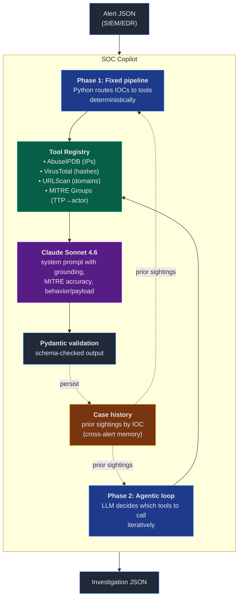

# SOC Copilot

An AI-assisted security alert investigator. Given a SIEM or EDR alert, it gathers threat intelligence, reasons through the evidence, and produces a structured investigation report — verdict, MITRE ATT&CK mapping, suggested pivots, and a sendable escalation draft.

Built as a learning project to explore agentic LLM patterns in a SOC context. The architecture is designed to scale toward production use (real SIEM integration, case management, multi-alert correlation), but the current implementation is intentionally small: two alert types, two threat intel tools, one eval harness.

## Quick example

Input — a brute-force SSH alert:

```json
{
  "alert_id": "ALRT-2026-0419-001",
  "source": "siem",
  "severity": "high",
  "title": "Multiple failed SSH authentications from single source",
  "raw_log": {
    "service": "sshd",
    "host": "prod-web-02.internal",
    "failed_attempts": 847,
    "source_ip": "185.220.101.47"
  },
  "indicators": {"ips": ["185.220.101.47"]}
}
```

Output (truncated):

```json
{
  "verdict": "true_positive",
  "confidence": "high",
  "hypothesis": "Automated SSH brute-force / credential stuffing attack from a known Tor exit node, targeting common privileged accounts...",
  "attack_techniques": [
    "T1110.001 - Brute Force: Password Guessing",
    "T1110.003 - Brute Force: Password Spraying",
    "T1090.003 - Proxy: Multi-hop Proxy"
  ],
  "escalation_recommended": true,
  "escalation_draft": "ESCALATION — Production host targeted by..."
}
```

The agent gathered this by calling AbuseIPDB, reading 90+ historical abuse reports, identifying the IP as a Tor exit node, and grounding each claim in tool output. Full reasoning transcript is included in the response.

## Architecture



Both modes produce the same `Investigation` schema. Run either through the same eval harness.

## Two operating modes, why both exist

**Phase 1 — fixed enrichment pipeline.** Python code looks at the alert indicators, routes IPs to AbuseIPDB and hashes to VirusTotal, hands the collected evidence to Claude, gets a structured investigation back. One LLM call per alert. Cheap, predictable, easy to debug.

**Phase 2 — agentic loop.** No routing in the Python layer. The model sees the alert, decides which tools (currently AbuseIPDB for IPs, VirusTotal for hashes, URLScan for domains, and MITRE ATT&CK Groups for threat-actor context) to call, observes the results, decides whether to call more tools, and eventually emits the final investigation. Multiple LLM calls per alert. More flexible, handles novel indicator combinations the Python layer doesn't know about.

Both exist because they're useful for different reasons. Phase 1 is the production-safe baseline — when you know the alert shape, fixed routing is faster and cheaper. Phase 2 is where the agent earns its keep — alerts with mixed indicators, ambiguous cases, novel TTPs. The eval harness runs both modes against the same expectations so you can A/B compare.

## Engineering decisions worth highlighting

These are the parts of the project that taught me something. Each one is grounded in a specific artifact you can check.

### Anti-hallucination: every claim ties back to a tool output

The `Evidence` Pydantic model is the contract. When the model wants to make a factual claim ("this IP was flagged for SSH brute-force on April 17"), there has to be an `Evidence` entry pointing at the tool output that supports it. The system prompt enforces "evidence before conclusions" — if the model lacks evidence, it must say so or call a tool, not confabulate.

I verified this works by inspecting raw tool outputs alongside the final investigation. The brute force run cited specific dates from specific abuse reports — every quoted date matched the AbuseIPDB response in `data/evals/runs/phase1_brute_force_after_prompt_fix.json`. Not one fabricated detail.

### The EICAR finding: behavior vs payload

Early phishing tests used the EICAR antivirus test file as the payload. EICAR is benign by design — every AV vendor flags it, but it's not malware. The first run produced `verdict: false_positive, no attack techniques apply` because the model anchored on payload identity.

That was wrong. The *delivery* — typosquatted sender domain, urgency language, executable in Outlook temp directory, user execution within 4 minutes of email receipt — is textbook spearphishing. A real attacker swapping EICAR for actual malware would have succeeded. The detection correctly identified suspicious behavior; the payload happened to be benign.

I added a "behavior vs payload" principle to the system prompt: evaluate attack behavior separately from payload verdict, and a benign payload through a malicious delivery channel is still a security event. The verdict flipped to `true_positive`, MITRE techniques showed up correctly (T1566.001 + T1204.002 + T1036.005), escalation fired.

Before/after artifacts: `data/evals/runs/phase1_phishing_payload_anchoring.json` vs `phase1_phishing_after_prompt_fix.json`.

### Model selection: empirical, not assumed

Started on Claude Haiku 4.5 to keep costs down. Worked fine for straightforward cases but surfaced a recurring failure on the phishing alert: the agent's reasoning would explicitly reject T1566.002 ("Spearphishing Link not applicable here, no link present") but still include T1566.002 in the JSON output. The reasoning self-corrected; the structured output didn't.

This is a real architectural failure mode in agentic systems — sometimes called "reasoning drift" or "stale structured output." The model commits a token to the JSON before its reasoning rejects it, and there's no go-back-and-edit mechanism in autoregressive generation.

Two fixes:

1. **Two-stage generation** — investigate in stage 1 (free-form reasoning), structure in stage 2 (separate LLM call that translates reasoning to JSON, can't contradict itself because reasoning is input not generated alongside output).
2. **Use a stronger model** — Sonnet 4.6 doesn't show this failure mode in practice.

I implemented two-stage but ended up reverting it after testing Sonnet single-stage. Three runs of the phishing alert on Sonnet, zero T1566.002 leaks. The simpler architecture won. Two-stage stays in my mental toolkit for when a stronger model isn't an option.

### Eval harness with invariants, not typical outputs

`tests/expectations.py` encodes what "correct" means for each alert. Early versions asserted on specific MITRE sub-techniques (T1110.003) and exact pivot phrasings ("rate-limit"). Those tests broke every time the model legitimately picked a different sub-technique or phrased a pivot slightly differently.

The fix: assert on *invariants* (must always be true for a useful investigation) rather than *typical outputs* (things the model often produces but doesn't have to). For brute force, the invariants are: T1110 family must appear (any sub-technique), verdict must be true_positive with high confidence, must escalate, must have a "check for successful authentication" pivot. Beyond that, the model has discretion.

This took three iteration cycles to calibrate. The harness is now stable across runs while still catching real regressions (cross-contaminated MITRE families, missing escalation, hallucinated tools).

### Two-mode parametrization in the harness

The eval harness runs both phase 1 and agentic mode against the same expectations. 28 assertions per run (7 properties × 2 alerts × 2 modes). When something fails, the failure message includes the mode, so I immediately see whether the regression is in the fixed pipeline or the agent.

This catches a class of bug that single-mode testing misses: when prompt changes accidentally diverge the two modes. If a system prompt change makes phase 1 better but breaks agentic, or vice versa, the parametrized tests surface it instantly.

### Grounding attribution deterministically

Threat-actor context is the one place the "every claim ties back to a source" rule is easiest to violate. Ask an LLM "which groups use these techniques" and it will happily name APTs from memory — some real, some subtly wrong, all unsourced. That's exactly the confabulation the rest of the project guards against.

So attribution is handled outside the model. `scripts/build_group_map.py` extracts the group→technique `uses` relationships from the official MITRE ATT&CK STIX bundle into a small committed lookup (`data/mitre/technique_groups.json`). The `associated_groups` field on every investigation is filled *deterministically in Python* from the final `attack_techniques` — in both modes — so each group name provably traces back to MITRE, never to the model's memory.

The agentic model still gets a `lookup_threat_actors` tool, but its job there is to *reason* about the overlap (fold it into the hypothesis and escalation call), not to author the structured field. The prompt is explicit that technique overlap is suggestive context, not attribution. The harness enforces the grounding: `test_associated_groups` asserts that every group's `matched_techniques` come from the investigation's own techniques, so a matcher regression can't silently invent overlap.

This is also the cleanest expression of the two-mode philosophy: threat-actor lookup operates on the investigation's *output* (techniques the LLM produced), not its *input* (alert indicators), so it can't be a pre-enrichment step like the IOC tools. Phase 1 annotates post-hoc; agentic can additionally reason mid-loop. Both end up with the same grounded field.

### Cross-alert memory, grounded

Real analysts don't triage each alert in a vacuum — they remember that *this IP was flagged true_positive last week*. `AlertHistoryStore` gives the copilot that memory: every investigation is persisted to a JSONL store indexed by IOC, and when a new alert shares an indicator with a past one, the prior sighting is surfaced.

The same grounding discipline as threat-actor context applies. Prior sightings are looked up *deterministically in Python* and injected into the prompt as context ("ALRT-… 2026-04-10, verdict=true_positive"); the `prior_sightings` field is filled from the store, never authored by the LLM. So the model can weigh real history in its hypothesis and escalation call, but it can't invent a past investigation that didn't happen.

Two details worth calling out. First, when the store has no match, the injected block is the empty string — an empty history leaves the prompt byte-for-byte unchanged, which keeps investigations deterministic and means the existing eval harness (which runs against an isolated empty store) is unaffected. Second, the core memory logic is a pure function of the store, so it's tested entirely without the API: `tests/test_history.py` records and looks up investigations directly, validating recurrence detection, self-exclusion, multi-IOC dedup, and recency ordering in milliseconds. The expensive API harness only has to confirm the wiring, not the logic.

## Project layout

```text
soc-copilot/
├── src/
│   ├── copilot.py          # The main class: investigate() and investigate_agentic()
│   ├── models.py           # Pydantic models: Alert, Evidence, GroupMatch, PriorSighting, Investigation
│   ├── mitre_groups.py     # Technique→threat-group matcher (reads the local map)
│   ├── history.py          # AlertHistoryStore: cross-alert memory indexed by IOC
│   ├── config.py           # Settings + env loading
│   ├── main.py             # CLI: python -m src.main <alert.json> [--agentic]
│   ├── prompts/
│   │   ├── system.py       # Phase 1 system prompt
│   │   └── agentic.py      # Phase 2 system prompt
│   └── tools/
│       ├── base.py         # Tool ABC, ToolResult model
│       ├── registry.py     # Tool registration + dispatch
│       ├── abuseipdb.py    # IP reputation
│       ├── virustotal.py   # File hash reputation
│       ├── urlscan.py      # Domain reputation
│       └── threat_actor.py # MITRE ATT&CK Groups (TTP → threat actor)
├── scripts/
│   └── build_group_map.py  # One-time: STIX bundle → committed group map
├── tests/
│   ├── test_investigations.py  # The eval harness (API-backed)
│   ├── test_history.py     # Cross-alert memory unit tests (no API)
│   └── expectations.py     # Per-alert correctness criteria
├── data/
│   ├── sample_alerts/      # Labeled alerts for testing
│   ├── mitre/              # Generated technique→group lookup (committed)
│   ├── history/            # Runtime case history (gitignored)
│   └── evals/runs/         # Captured before/after investigations
└── pyproject.toml
```

## Running it

Requires Python 3.12+ and [uv](https://github.com/astral-sh/uv).

```bash
# Install dependencies
uv sync

# Set up API keys
cp .env.example .env
# Edit .env with your Anthropic, AbuseIPDB, and VirusTotal keys

# Run a sample alert (phase 1 mode)
uv run python -m src.main data/sample_alerts/brute_force_ssh.json

# Run with agentic mode
uv run python -m src.main data/sample_alerts/brute_force_ssh.json --agentic

# Run the eval harness
uv run pytest tests/test_investigations.py -v
```

The MITRE ATT&CK group map (`data/mitre/technique_groups.json`) is committed, so
threat-actor lookup works out of the box with no extra key. To refresh it against
the latest ATT&CK release:

```bash
uv run python scripts/build_group_map.py
```

API keys:

- Anthropic: [console.anthropic.com](https://console.anthropic.com) (≈$0.05 per investigation on Sonnet)
- AbuseIPDB: [abuseipdb.com](https://www.abuseipdb.com) (free tier, 1000 req/day)
- VirusTotal: [virustotal.com](https://www.virustotal.com) (free tier, 4 req/min, 500/day)
- URLScan: [urlscan.io](https://urlscan.io) (free tier, 1000 scans/day, 60/min)

## Roadmap

The project is research-grade today. Three concrete directions to grow it.

### Near-term: real alert sources and broader threat intel

- **Elastic SIEM integration** — pull alerts from Elastic via the detection engine API, pipe through the copilot, push the investigation back as a custom field on the alert document. This is the next thing I want to build.
- ~~**Domain reputation tool**~~ ✅ Implemented via URLScan.io. The agent now calls check_domain_reputation on domains in alert indicators. "No historical scans" is treated as a positive signal for newly-registered attacker infrastructure.
- ~~**Threat actor lookup**~~ ✅ Implemented via a local MITRE ATT&CK Groups map. After the technique mapping is formed, the copilot surfaces groups whose documented TTPs overlap the observed techniques ("these chain in a way associated with FIN7"), ranked by overlap. The group data is extracted from the official ATT&CK STIX bundle by `scripts/build_group_map.py` into a small committed lookup, so runtime is offline and — crucially — group names can't be hallucinated. See "Grounding attribution deterministically" below.
- **Sigma rule matching** — given the raw log, match it against community Sigma rules to surface relevant detection logic. This bridges from "the alert fired" to "and here's why the detection exists" in a maintainable way.

### Medium-term: memory and correlation

- ~~**Alert history store**~~ ✅ Implemented via `AlertHistoryStore` (JSONL-backed, indexed by IOC). Every investigation persists; when a new alert shares an indicator with a past one, the copilot surfaces that prior sighting as grounded context in both modes. The cross-alert memory a human analyst keeps in their head. See "Cross-alert memory, grounded" below.
- **Multi-alert correlation** — if three brute-force alerts hit three different hosts from related IPs in the same hour, the copilot should recognize the pattern. Right now each alert is isolated.

### Long-term: case management integration

- **TheHive or DFIR-IRIS output** — investigations write directly into a case management system as observables, tasks, and analyst notes. Closes the loop from alert to triage.
- **Autonomous closure** — for low-risk, high-confidence false positives (well-understood patterns), the copilot can close the case with a justification. Saves analyst time on the obvious stuff. This is the ambitious end of the project.

## Limitations and honest caveats

- **Two alert types only.** Brute force and phishing-with-attachment. Real SOC environments have dozens of alert classes. The architecture scales but the testing doesn't yet.
- **Memory is single-indicator, not correlated.** The copilot now remembers past investigations and surfaces prior sightings when an IOC recurs (`AlertHistoryStore`), but it doesn't yet *correlate* — e.g. recognizing that three alerts on different hosts form one campaign. That's the next step.
- **Tool coverage is shallow.** Three external threat-intel sources (IP, hash, domain) plus a local MITRE ATT&CK Groups lookup. Production use still needs sandbox detonation, internal log search, and richer reputation feeds.
- **No human-in-the-loop UI.** Output is JSON. Useful for piping into other systems, not for an analyst sitting at a console.
- **LLM costs.** Sonnet runs ≈$0.03–0.05 per investigation. At SOC volumes (thousands of alerts/day) this adds up. Production would need a tiered approach: cheap model for triage, expensive model for ambiguous cases.
- **No security review.** The agent can be prompted by alert content. An attacker who can inject content into a SIEM alert could potentially manipulate the agent's reasoning. Production needs prompt injection defenses.

## Why I built this

I'm a SOC analyst. Most of my job is the same investigation pattern repeated across thousands of alerts: triage, enrich, decide, document. LLMs are very good at this kind of structured judgment work, but most "AI for SOC" tools I've seen are either thin wrappers around GPT or heavyweight enterprise products that don't show their work.

I wanted to know what the architecture actually looks like — what breaks, what works, where the model's reasoning lives, how you keep it honest. The answers are interesting. The failure modes are subtle. The eval discipline is harder than the agent itself.

This codebase is what I learned, written down.